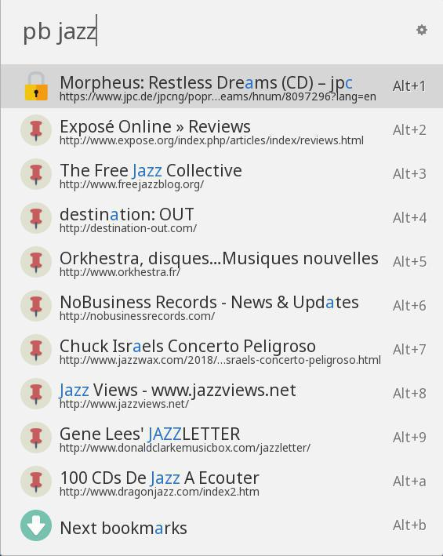
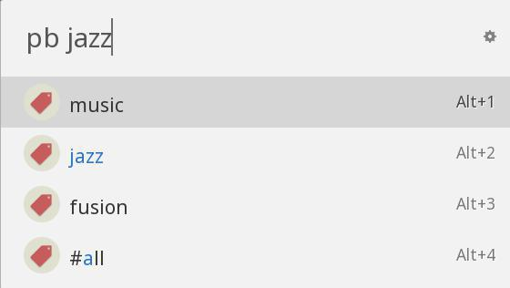

# Ulauncher Pinboard Search

### [Ulauncher](https://ulauncher.io) extension for searching your [Pinboard.in](https://pinboard.in) bookmarks.

## Description

Search and browse your Pinboard bookmarks and tags.

## Use
> pb

List your most recent bookmarks.

> pb query

Search your bookmarks matching the search query and list them.

A bookmark is listed when at least one of the following elements contains the search query:
* description
* tags
* href
* extended

All bookmarks are downloaded into a local json file. It is refreshed when Ulaunch starts
if the existing file is older than 24 hours.

Press:
* Enter to open the selected bookmark in your browser.
* Alt-Enter to list its tags.

Then select a tag and press:
* Enter to search bookmarks by tags.
* Alt-Enter to open the Pinboard.in search url in your browser.

> pt tag1/../tagn

List all bookmarks that have the given tags.

If called without tags, list all bookmarks without tags.

## Requirements

* jq no longer required. Simple filtering is way faster!
* simplejson --> sudo pip2 install simplejson

## Install

> https://github.com/nicolasm/ulauncher-pinboard-search

## Usage

You must fill your Pinboard API token and username in the extension settings.
